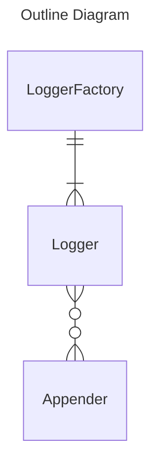

# Logback4js

Logger for JavaScript inspired by Logback.

## Overview

| Class | Role |
| ---- | ---- |
| LoggerFactory | Factory class of Loggers. |
| Logger | Manage and log Appenders. |
| Appender | Define output destination and append log. |

## Appenders

List of Appenders library provides:
- Console Appender
    - core module.
- HTTP POST Appender
    - core module.
- IndexedDB Appender
    - core module.
- LocalStorage Appender
    - core module.
- Google Analytics Appender
- Google Analytics for Firebase Appender
- Slack Appender
    - Not Tested.
- Twitter Appender
    - Using this Appender in browser, proxy setting is required to bypass CORS.
    - Not Tested.
- Microsoft Teams Appender
    - Not Tested.
    - Use workflow with custom HTTP POST Appender might be better.
- Discord Appender
    - Not Tested.
    - Use Discord Webhook Appender might be better.
- Discord Webhook Appender
    - Not Tested.
- LINE Messaging API Appender
    - Not Tested.
- LINE Notify Appender
    - Not Tested.

## Versioning

After release version 1.0.0, follow the rules of [SemVer](https://semver.org/spec/v2.0.0.html).

## Build

Run `npm run build` to build the project. The build artifacts will be stored in the `dist/` directory.

## Running unit tests

Run `npm run test` to execute the unit tests via [Jest](https://jestjs.io/).
