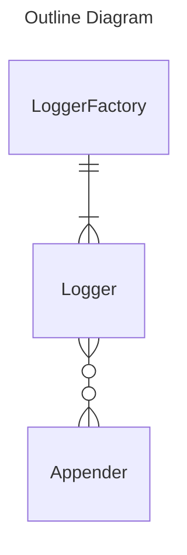

# Logback4js

Logger for JavaScript inspired by Logback.

## Overview

```mermaid
---
title: "Outline Diagram"
---
erDiagram
    LoggerFactory ||--|{ Logger: ""
    Logger }o--o{ Appender: ""

```

| Class | Role |
| ---- | ---- |
| LoggerFactory | Factory class of Loggers. |
| Logger | Manage and log Appenders. |
| Appender | Define output destination and append log. |

## Appenders

List of Appenders library provides:

| Appender | Module | Description |
| ---- | ---- | ---- |
| Console Appender | `@logback4js/core` | Output to console. Core module. |
| HTTP POST Appender | `@logback4js/core` | Post logging API. Core module. |
| IndexedDB Appender | `@logback4js/core` | Output to IndexedDB. Core module. |
| LocalStorage Appender | `@logback4js/core` | Output to LocalStorage. Core module. |
| Google Analytics Appender | `@logback4js/google-analytics` | Send event using [Google Analytics](https://developers.google.com/analytics). |
| Google Analytics for Firebase Appender | `@logback4js/google-analytics` | Send event using [Google Analytics for Firebase](https://firebase.google.com/docs/analytics). |
| Slack Appender | `@logback4js/slack` | Send message using [Slack Web API](https://api.slack.com/web). Not tested yet. |
| Twitter Appender | `@logback4js/twitter` | Send message using [SDKs wrap the X API](https://developer.x.com/en/docs/x-api/tools-and-libraries/sdks/overview#item1). Using this Appender in browser, proxy setting is required to bypass CORS. Not tested yet. |
| Microsoft Teams Appender | `@logback4js/microsoft` | Send message to Teams using [Microsoft Graph](https://learn.microsoft.com/graph/sdks/create-client?tabs=typescript). Use workflow with custom HTTP POST Appender might be better. Not tested yet. |
| Discord Appender | `@logback4js/discord` | Send message using [discord.js](https://discord.js.org). Use Discord Webhook Appender might be better. Not tested yet. |
| Discord Webhook Appender | `@logback4js/discord` | Send message using [Discord Webhook](https://discord.com/developers/docs/resources/webhook). Not tested yet. |
| LINE Messaging API Appender | `@logback4js/line` | Send message using [LINE Messaging API](https://developers.line.biz/en/services/messaging-api/). Not tested yet. |
| HTTP POST Appender for Angular | `@logback4js/angular` | Send message using [Angular HttpClient](https://angular.dev/guide/http). |

## Versioning

After release version 1.0.0, follow the rules of [Semantic Versioning 2.0.0](https://semver.org/spec/v2.0.0.html).

1. **MAJOR**: Update core module including breaking change.
2. **MINOR**: Update core module NOT including breaking change or update others such as adding new features.
3. **PATCH**: Update NOT including behavior change such as update documents or dependencies.

## Build

Run `npm run build` to build the project. The build artifacts will be stored in the `dist/` directory.

## Running unit tests

Run `npm run test` to execute the unit tests via [Jest](https://jestjs.io/).
