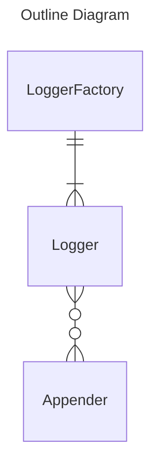

# Logback4js

Logger for JavaScript inspired by Logback.

## Overview

| Class | Role |
| ---- | ---- |
| LoggerFactory | Factory class of Loggers. |
| Logger | Manage and log Appenders. |
| Appender | Define output destination and append log. |

## Appenders

List of Appenders library provides:
- Console Appender
- HTTP POST Appender
    - dependencies: [axios](https://www.npmjs.com/package/axios)
- IndexedDB Appender
- LocalStorage Appender
    - dependencies: [uuid](https://www.npmjs.com/package/uuid)
- Google Analytics Appender
- Google Analytics for Firebase Appender
    - dependencies: [firebase/analytics](https://www.npmjs.com/package/@firebase/analytics)
- Slack Appender
    - dependencies: [@slack/web-api](https://www.npmjs.com/package/@slack/web-api)
    - Not Tested.
- Twitter Appender
    - dependencies: [twitter-api-sdk](https://www.npmjs.com/package/twitter-api-sdk)
    - Using this Appender in browser, proxy setting is required to bypass CORS.
    - Not Tested.
- Microsoft Teams Appender
    - dependencies: [@microsoft/microsoft-graph-client](https://www.npmjs.com/package/@microsoft/microsoft-graph-client)
    - Not Tested.
    - Use workflow with custom HTTP POST Appender might be better.
- Discord Appender
    - dependencies: [discord.js](https://www.npmjs.com/package/discord.js)
    - Not Tested.
    - Use Discord Webhook Appender might be better.
- Discord Webhook Appender
    - dependencies: [axios](https://www.npmjs.com/package/axios)
    - Not Tested.

## Build

Run `npm run build` to build the project. The build artifacts will be stored in the `dist/` directory.

## Running unit tests

Run `npm run test` to execute the unit tests via [Jest](https://jestjs.io/).
